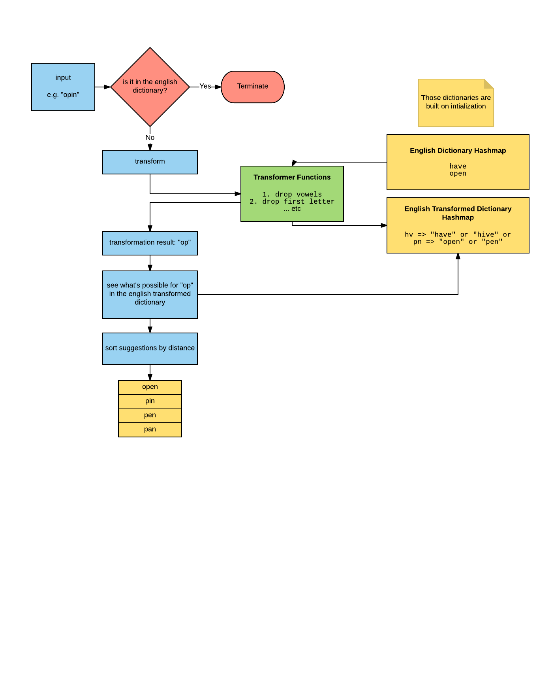

# Spelt

JavaScript english spellchecker written in TypeScript.


## Bundled Dictionaries

- English US
- English GB

## Installation

```
npm i --save spelt
```

## Usage

```typescript
// import
import spelt from "spelt";
// build dictionary
const check = spelt({
	lang:"gb",
	// can be either "gb" or "us"
	distanceThreshold:0.2
	// when a correction found with this distance
	// we'll stop looking for another
	// this would improve performance
});

console.log(check("heve"));
```

The above code would output:

```javascript
{
	// the raw input
	raw:"heve",
	// correct or not
	correct:false
	// corrections array sorted by string distance
	[
		{
			// possible correction
			correction:"have",
			// distance from the input word
			distance:0.4
		},
		// .... other possible corrections
	]
}
```

## How it works



## String Distance

I've noticed that a lot of spellcheckers are using the __levenshtein distance (LD)__, I don't think it's the appropriate solution, since it doesn't take moving a two letters around in consideration.

For example:
1. the distance between `abcde` and `abcxx` is `2`.
2. the distance between `abcde` and `abced` is also `2`.

But on the first case we introduced two new letters, and removed two letters! while on the second case we just moved the `e` and `d` around without introducing or removing any letter.

So in short, I don't see the levenshtein distance as an appropriate solution for a spellchecker.

I've wrote my own string distance calculator and you can find it [here](https://github.com/FinNLP/strdistance).

## Performance

- __Spellchecking a book:__ Processing H.G Wells Novel _The Time Machine_ with (1000s of misspellings introduced took about 8 seconds), in a rate of __4K words/second__.
- __[Spellchecking Wikipedia list](http://en.wikipedia.org/wiki/Wikipedia:Lists_of_common_misspellings/For_machines):__ Processing about 4 thousands words, all misspelt, took about 3.5 seconds with a rate of __1K word/second__.

This is not very impressive, but I'm working on it. However, it's far better than [Norvig's](http://norvig.com/spell-correct.html) spellchecker.

## Accuracy

Running on [wikipedia's list](http://en.wikipedia.org/wiki/Wikipedia:Lists_of_common_misspellings/For_machines), with a distance threshold of `0`, It was able to find the accurate correction in the first 10 suggestions on __~90%__ of the cases.

## TODO

- Clean up transformations, as some of them might be useless.
- Introduce more accurate transformations.
- Using a case sensitive dictionary might improve performance and accuracy considerably.

## License

The MIT License